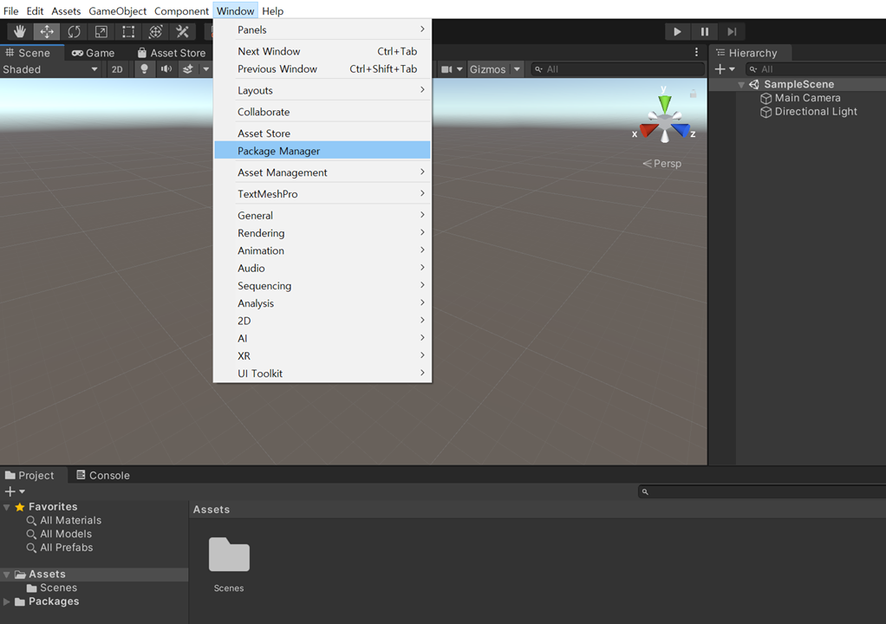

# [빌드방법] 안드로이드폰 (with Windows or Mac)

https://www.youtube.com/watch?v=gi9iHTY9z1o

## 1. AR Foundation 프로젝트 세팅

---

`Window` - `Package Manager` 선택

`AR Foundation`,  `ARCore XR Plugin` 설치

1. `SampleScene` 하위에 있는 `Main Camera` 삭제

2. 마우스 오른쪽 클릭 - `XR` - `AR Session` 과 `AR Session Origin` 추가

1. `AR Session Origin` 하위의 `AR Camera` 선택
2. Inspector 창에서 `Tag` 를 `MainCamera` 로 설정

## 2. Android 빌드 세팅

---

`File` - `Build Settings` 선택

1. `Add Open Scenes` : 빌드할 씬 선택
2. `Android` 선택
3. `Switch Platform` 선택
4. `Player Settings` 선택

1. `XR Plug-in Management` 메뉴
2. `ARCore` 체크

1. `Player` 메뉴 선택
2. `Graphics APIs` 에서 `Vulkan` 선택 후 삭제
3. `Minimum API Level` 은 API level 24 이상으로 설정

`Run Device` 에서 앱을 설치할 디바이스를 선택

만약 USB로 연결한 디바이스가 뜨지 않는 경우, 안드로이드폰에서 개발자 모드를 켜주셔야 합니다.

✨ 설정 → 시스템 → 휴대전화 정보 → 빌드번호 (여러번 탭 해주면 개발자 옵션 메뉴가 생깁니다) → 개발자 옵션 ON → USB 디버깅 ON

📄 참고 : [https://developer.android.com/studio/debug/dev-options?hl=ko](https://developer.android.com/studio/debug/dev-options?hl=ko)

설정 완료 후에 `Build And Run` 선택

## 4. 결과

---

Unity 로고가 뜨면서 카메라 화면이 뜨면 AR 빌드가 정상적으로 된겁니다 😁