# [빌드방법] 아이폰/아이패드 (with Mac)

https://www.youtube.com/watch?v=0g7tFKEbBNg

## 1. AR Foundation 프로젝트 세팅

---

`Window` - `Package Manager` 선택

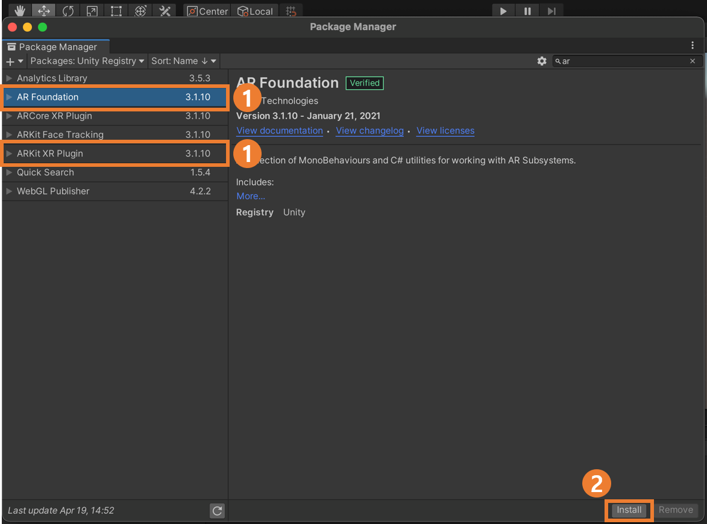

`AR Foundation`,  `ARKit XR Plugin` 설치

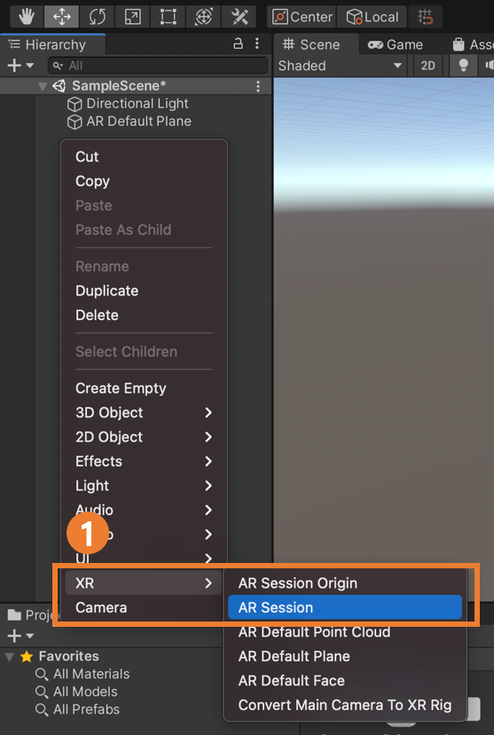

1. `SampleScene` 하위에 있는 `Main Camera` 삭제

2. 마우스 오른쪽 클릭 - `XR` - `AR Session` 과 `AR Session Origin` 추가

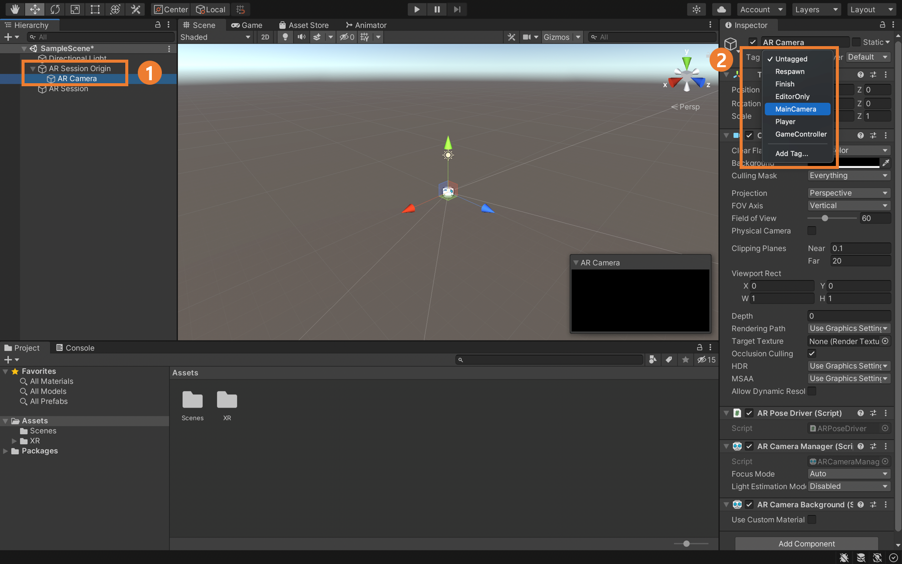

1. `AR Session Origin` 하위의 `AR Camera` 선택
2. Inspector 창에서 `Tag` 를 `MainCamera` 로 설정

## 2. IOS 빌드 세팅

---

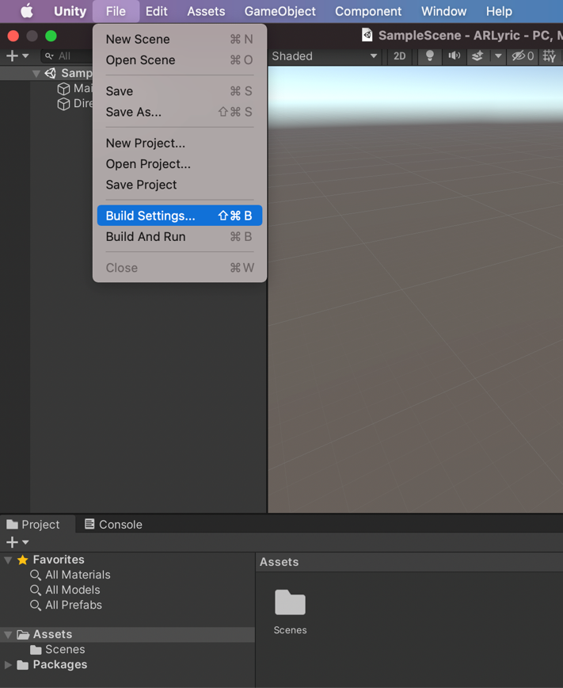

`File` - `Build Settings` 선택

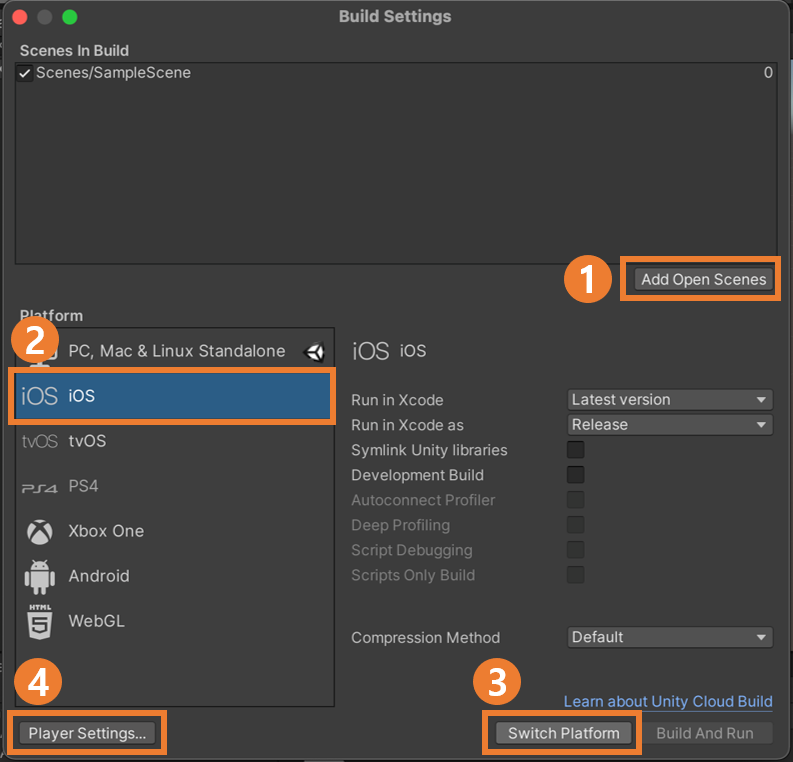

1. `Add Open Scenes` : 빌드할 씬 선택
2. `iOS` 선택
3. `Switch Platform` 선택
4. `Player Settings` 선택

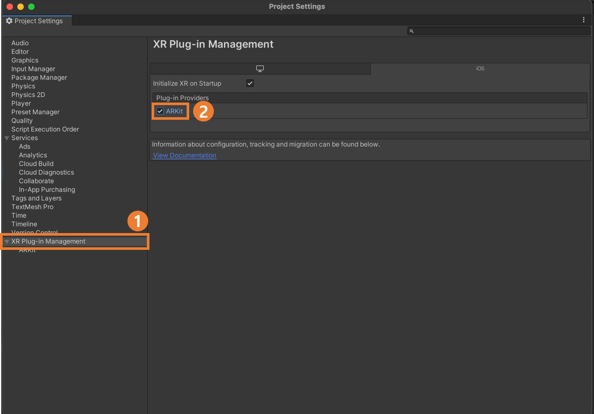

1. `XR Plug-in Management` 메뉴
2. `ARKit` 체크

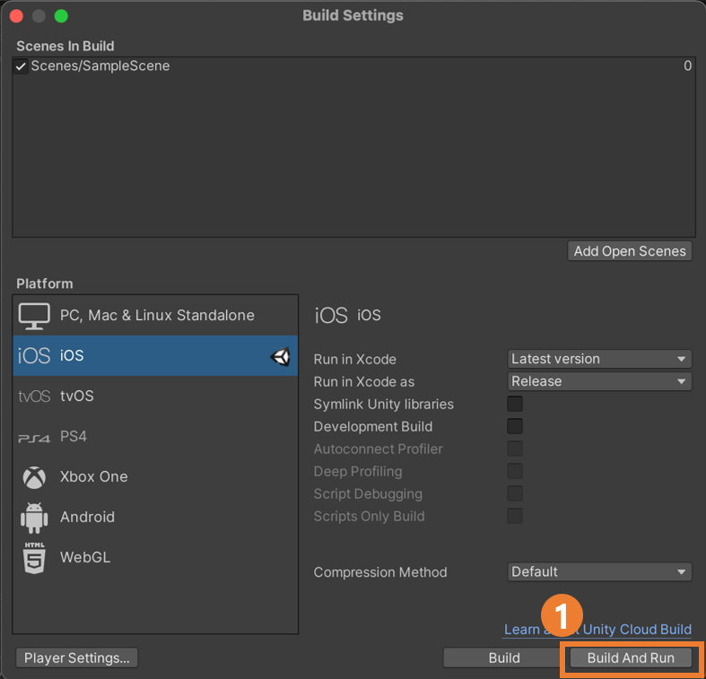

설정 완료 후에 `Build And Run` 선택

정상적으로 빌드가 완료되면 XCode가 자동으로 뜹니다.

## 3. XCode 설정

---

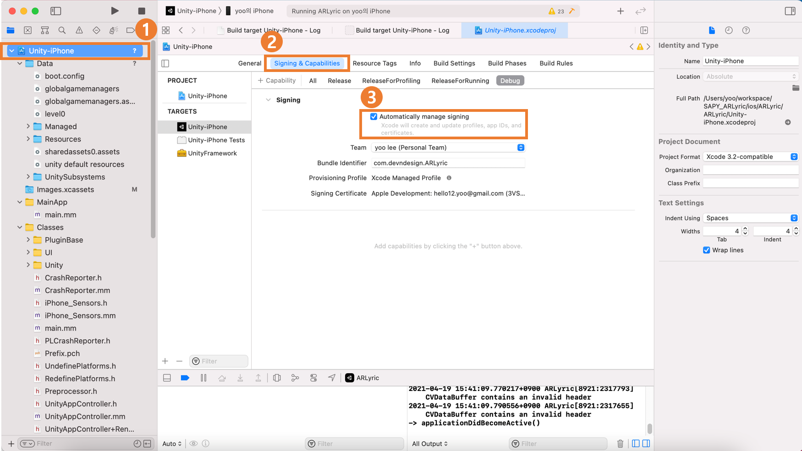

1. 프로젝트 선택
2. `Signing & Capabilities` 메뉴 선택
3. `Automatically managing signing` 체크

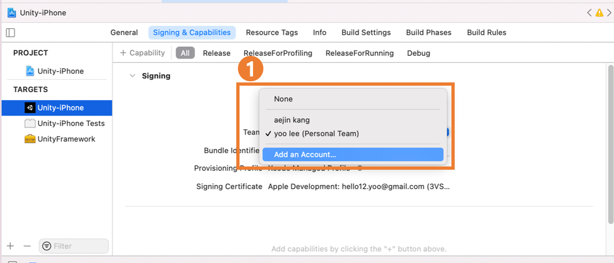

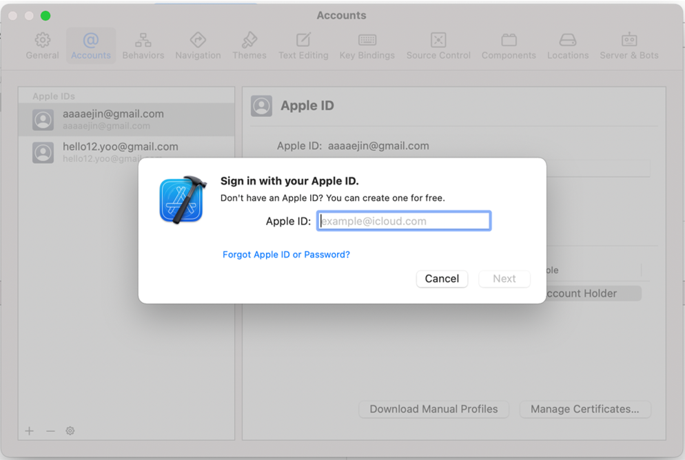

Team 에서 `Add an Account` 를 클릭해 애플 계정 등록

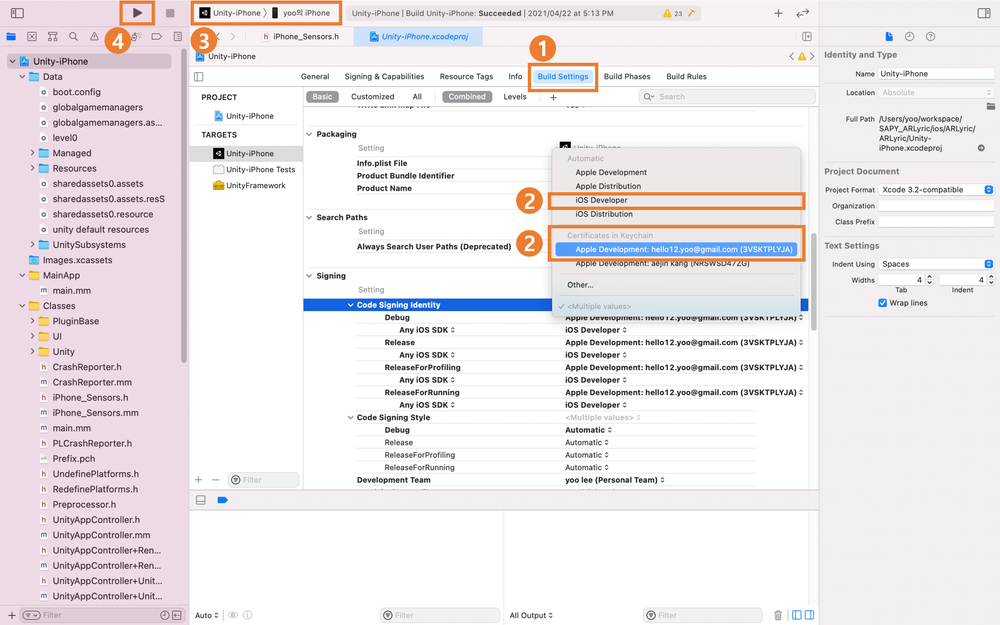

1. `Build Settings` 메뉴 선택
2. `Signing` 메뉴의 `Code Signing Identity` 선택. 위에서 등록한 애플 계정 선택
3. 앱을 설치할 디바이스 선택 (아이폰이나 아이패드가 맥에 연결되어 있어야 합니다)
4. 빌드

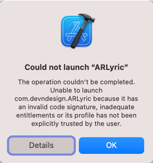

빌드 시, 위와 같이 신뢰할 수 없는 개발자 관련 오류가 나오면 아이폰/아이패드에서 아래와 같이 조치해주시면 됩니다.

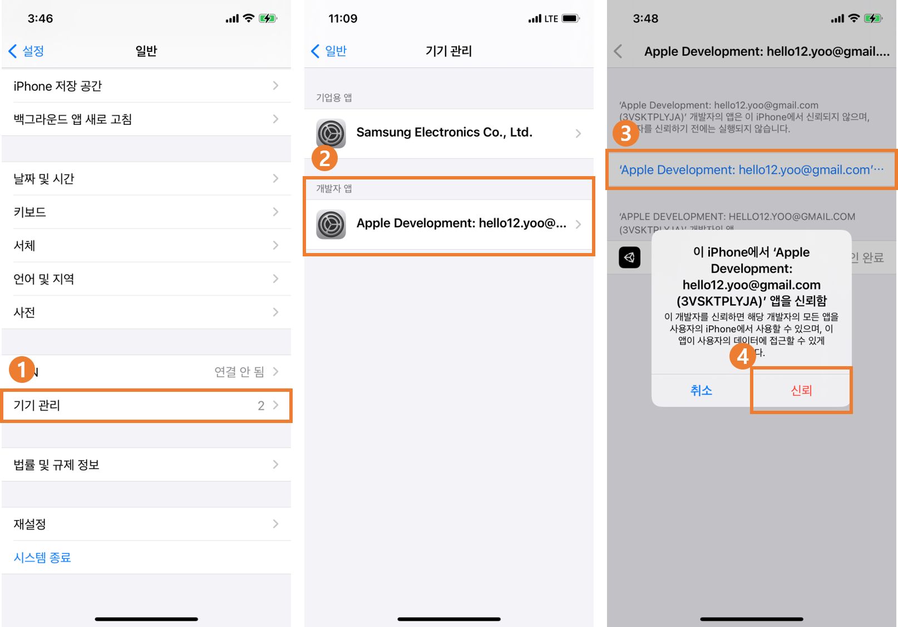

`설정` - `일반` - `기기 관리` - `개발자 앱` - `신뢰`

## 4. 결과

---

Unity 로고가 뜨면서 카메라 화면이 뜨면 AR 빌드가 정상적으로 된겁니다 😁